# Intro to Deconvolution and Restoration

## What is Deconvolution?

* A procedure used to reverse convolution
* Convolution (blurring) -> Deconvolution (reverse blur)
* Also need to consider noise

Deconvolution is a type of image restoration which attempts to restore the true signal in the presence of blur and noise.

The problem is ill-poised (information is lost thus cannot restore original completely)

## What is the Point Spread Function (PSF) ?

* Describes response of imaging system to a point like object.
* PSF is the basic unit of Image Formation.
* A lens does not focus light as a point but rather as a difraction pattern in the lateral plane.
* The 3D PSF of widefield instruments are hour glass when viewed in the z plane.
* The 3D PSF of confocal instruments are football shaped when viewed in the z plane. 

  
  

## Imaging Process

* Image = Truth convolved with PSF + Noise

Having a means to run a forward imaging model is important for 

1.  Creating simulations to test deconvolution
2.  Creating simulations to train deep learning restoration systems. 

  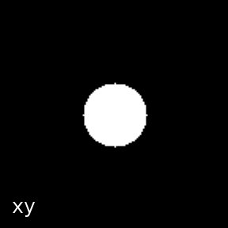
  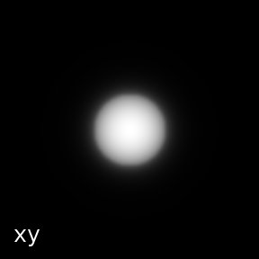
  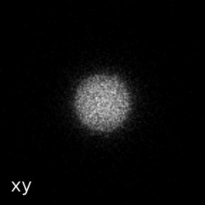

  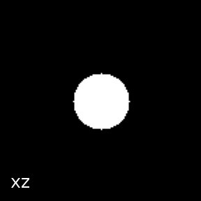
  
  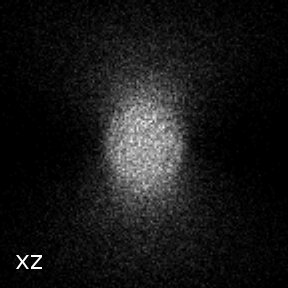

## Deconvolution

* Deconvolution restores high frequencies  
  * Microscope OTF is band limited so some frequencies lost completely (ill-posed)
* Noise has high frequencies thus deconvolution can amplify noise.

## Deconvolution approaches

1.  Solve in frequency domain (Inverse Filter)
2.  Solve in frequency domain and use regularization to minimize noise (Wiener Filter)
3.  Iterative approaches (Richardson Lucy)
4.  Iterative approaches with regularization (Richardson Lucy with Total Variation Regularization)

## Richardson Lucy Iterations

The images below show left to right the blurred sphere and the result of 10, 20 and 30 accelerated Richardson Lucy iterations. 

  
  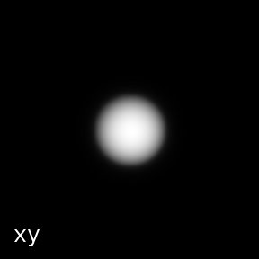
  
  

  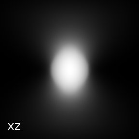
  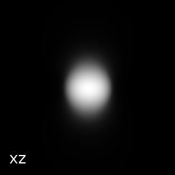
  
  

## Richardson Lucy with Total Variation regularization (Noisy Image)

Richardson Lucy Deconvolution can amplify noise, so regularization is used to limit noise.  Once approch is the Richardson Lucy with Total Variation algorithm (Dey etc. al. 2006).  The image on the left was deconvolved with 50 iterations of accelerated Richardson Lucy Deconvolution, the Image on the right with 50 iterations of accelerated Richardson Lucy with Total Variation regularization (regularization factor = 0.002).

  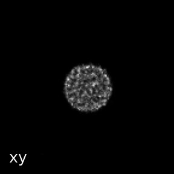
  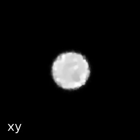

  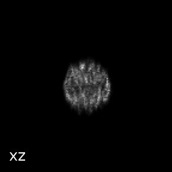
  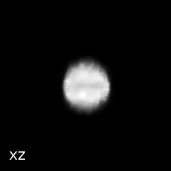

## Edge Handling

Non-circulant deconvolution (BIG Lab technical note 2014, M. Bertero, P. Boccaci 2005) 

## How do we make deconvolution fast?

* Algorithm acceleration
    * Take a bigger step at each iteration
    * Vector Acceleration (Biggs)
Hardware acceleration
    * Fast math libraries
    * Multi-threading
    * GPU

