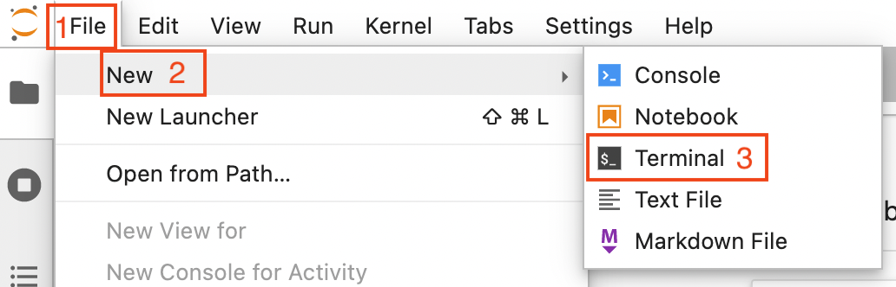
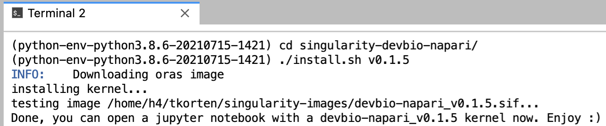
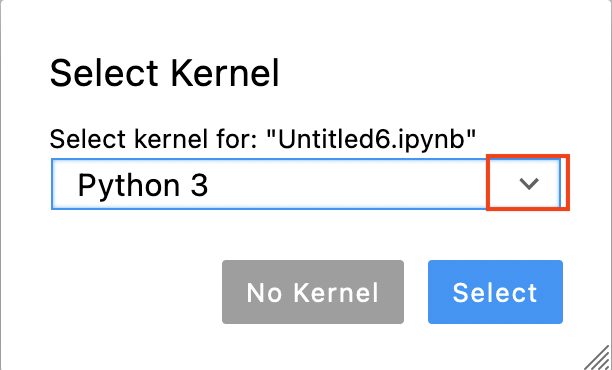

# Running deconvolution on the ZIH cluster

Log in to taurus as described [here](https://biapol.github.io/PoL-BioImage-Analysis-TS-GPU-Accelerated-Image-Analysis/50_Clesperanto_on_HPC/login_taurus.html).

Once you are in jupyter lab, open a terminal by clicking on `File` (1 in the image below) -> `New` (2) -> `Terminal` (3)



to download the jupyter notebooks, execute the following command:

```bash
git clone https://github.com/BiAPoL/PoL-BioImage-Analysis-TS-GPU-Accelerated-Image-Analysis
```

To install a devbio-napari python environment, execute the following code in the terminal:

```bash
git clone https://gitlab.mn.tu-dresden.de/bia-pol/singularity-devbio-napari.git
cd singularity-devbio-napari
./install.sh deconvolution_course
```

Wait 2-15 min until the image is downloaded and verified (the time depends on how much network and disk load is on the cluster). The output should look something like this:



No you can open a Jupyter Notebook with the newly installed environment

Reload the browser tab.

Use the file browser on the left to navigate to the deconvolution notebooks: `PoL-BioImage-Analysis-TS-GPU-Accelerated-Image-Analysis/docs/30_Deconvolution`

Open a new notebook by double clicking it

Now you are asked to select a kernel. Click on the drop down button (red rectangle in the image below).



Choose the kernel you just installed: `devbio-napari_-_deconvolution_course`

NB: for an existing notebook, you can click on the kernel name (by default `Python 3`) in the top right corner of the notebook and aelect the devbio-napari kernel as described above.


