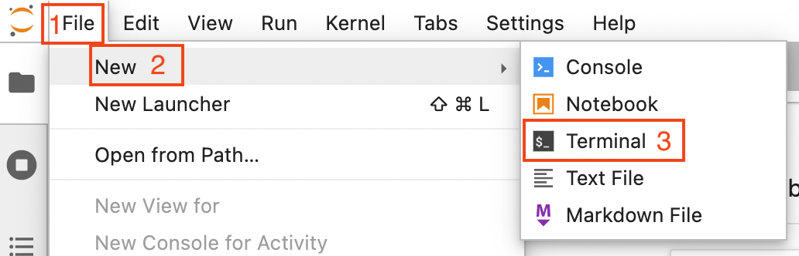

# Executing clesperanto on the TU Dresden HPC

To execute Python Jupyter notebooks on TU Dresden's HPC cluster, navigate to this URL: 
https://taurus.hrsk.tu-dresden.de/jupyter/hub/home

Note: If you're outside the university network, you need to connect via [VPN](https://tu-dresden.de/zih/dienste/service-katalog/arbeitsumgebung/zugang_datennetz/vpn).

After loggin in, a Jupyter Hub login screen will open. Click on `Start My Server`.


Select the entries as shown below in the `Advanced` tab and click on `Spawn`.


This will take a moment.


You will be redirected to a Jupyter Lab environment. 

Now you need to activate the install a singularity container on the HPC cluster as explained [in detail here](https://gitlab.mn.tu-dresden.de/bia-pol/singularity-devbio-napari#quick-start). In short:

Open a terminal by clicking on `File` (1 in the image below) -> `New` (2) -> `Terminal` (3)



Install a custom jupyter kernel for your user

To install a devbio-napari python environment, execute the following code in the terminal:

```bash
git clone https://gitlab.mn.tu-dresden.de/bia-pol/singularity-devbio-napari.git
cd singularity-devbio-napari
./install.sh v0.2.9
```

Wait 2-15 min until the image is downloaded and verified (the time depends on how much network and disk load is on the cluster). The output should look something like this:


Now reload the browser tab.

Use the upload button to upload your assistant-generated notebook. You can also use this [example notebook](napari_assistant_generated_notebook.ipynb).


Double-click the uploaded notebook to open it. Select a kernel, e.g. the devbio-napari kernel.


In this notebook, you need to change how files are opened.


You find a potential modification on the following page.


