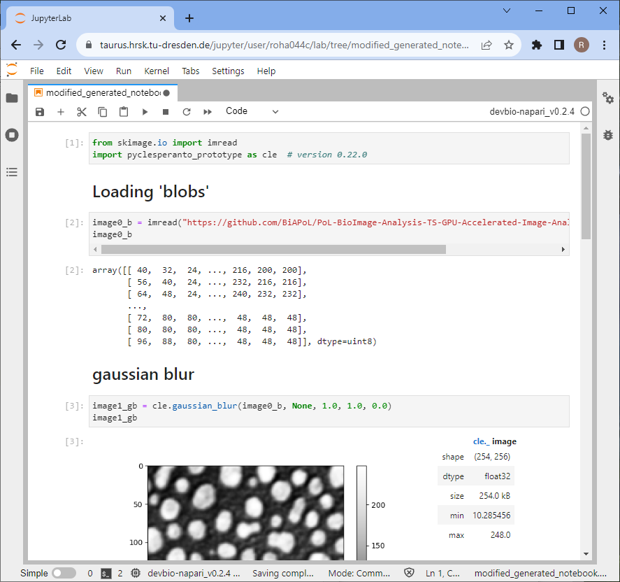

# Executing clesperanto on the TU Dresden HPC

To execute Python Jupyter notebooks on TU Dresden's HPC cluster, navigate to this URL: 
https://taurus.hrsk.tu-dresden.de/jupyter/hub/home

Note: If you're outside the university network, you need to connect via [VPN](https://tu-dresden.de/zih/dienste/service-katalog/arbeitsumgebung/zugang_datennetz/vpn).

After loggin in, a Jupyter Hub login screen will open. Click on `Start My Server`.

Select the entries as shown below in the `Advanced` tab and click on `Spawn`.

This will take a moment.

You will be redirected to a Jupyter Lab environment. 

Use the upload button to upload your assistant-generated notebook. You can also use this [example notebook](napari_assistant_generated_notebook.ipynb).

Double-click the uploaded notebook to open it. Select a kernel, e.g. the devbio-napari kernel.

In this notebook, you need to change how files are opened.

You find a potential modification on the following page.

