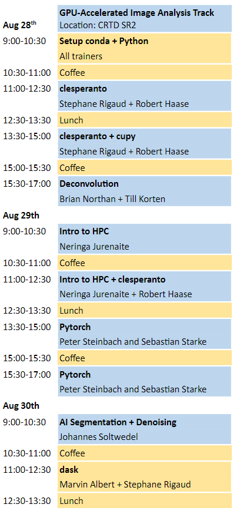
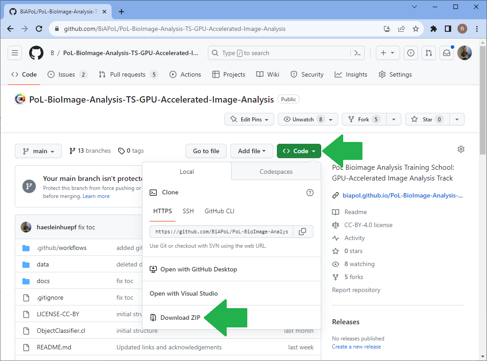
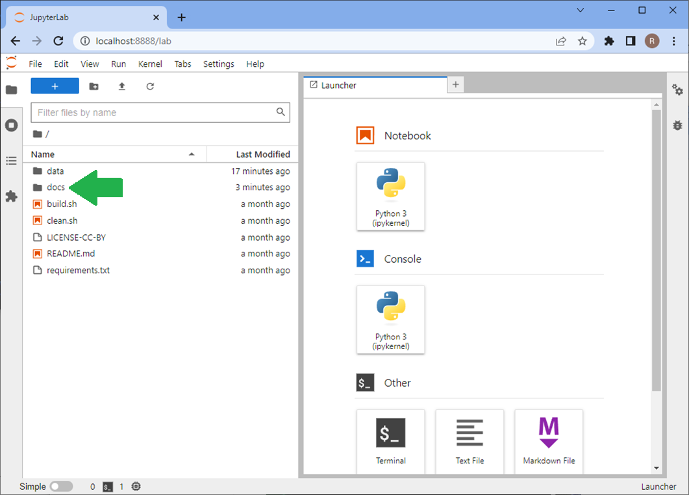
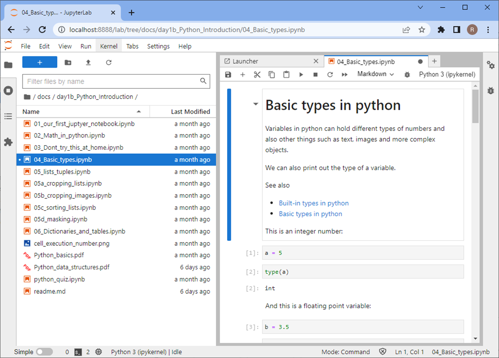

# PoL Bio-Image Analysis Training School on GPU-Accelerated Image Analysis

This [Jupyter book](https://jupyterbook.org/) contains training resources for scientists who want to dive into GPU-accelerated image processing. It specifically aims for students and scientists working with microscopy images in the life sciences.

Here, we cover the *GPU-Accelerated Image Analysis* Track of the [PoL Bio-Image Analysis Symposium](https://biopol-training.eventmember.de/). We will process images using [clesperanto](https://clesperanto.github.io/), [cupy](https://cupy.dev/) and [Pytorch](https://pytorch.org/). We will denoise, deconvole and segment images with and without deep learning techniques. We will get an introduction in how to [TU Dresden HPC cluster Taurus](https://tu-dresden.de/zih/hochleistungsrechnen/hpc) and distribute tasks using [dask](https://www.dask.org/).

## Timetable



## How to use this material

For following the course, we recommend downloading [the repository from which this Jupyter book is made](https://github.com/BiAPoL/PoL-BioImage-Analysis-TS-GPU-Accelerated-Image-Analysis).
All Jupyter Notebooks are executable so that attendees can reproduce all demos and exercises.



Assuming you downloaded the repository to your Desktop, you can open the Jupyter book by opening a terminal and typing:

```bash
cd Desktop/PoL-BioImage-Analysis-TS-GPU-Accelerated-Image-Analysis
```
```bash
conda activate devbio-napari-env
```
```bash
jupyter lab
```

Using Jupyter lab, you can navigate to the course lessons in the `docs` folder.


... and execute the code and experiment with it.


## Feedback and support

If you have any questions create a [github issue](https://github.com/BiAPoL/PoL-BioImage-Analysis-TS-GPU-Accelerated-Image-Analysis/issues).
Alternatively, open a thread on [image.sc](https://image.sc), put a link to the lesson or exercise you want to ask a question about and tag @haesleinhuepf.

## Acknowledgements

This course was held in Dresden, August 2023.
We would like to thank all the people who shared teaching materials we are reusing here.
We acknowledge support by the Deutsche Forschungsgemeinschaft under Germany’s Excellence Strategy—EXC2068–Cluster of Excellence Physics of Life of TU Dresden.
This project has been made possible in part by grant number 2021-237734 (GPU-accelerating Fiji and friends using distributed CLIJ, NEUBIAS-style, EOSS4) from the Chan Zuckerberg Initiative DAF, an advised fund of the Silicon Valley Community Foundation.
